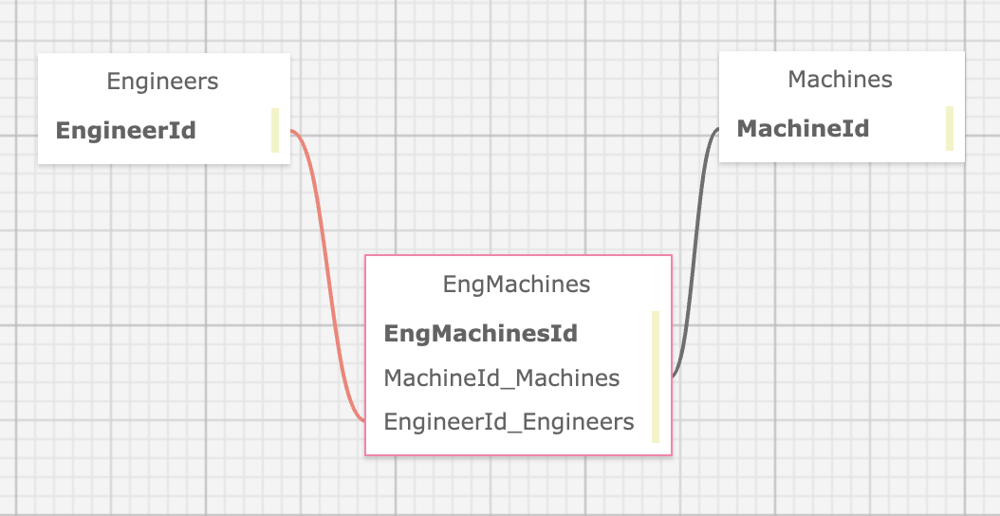

# Dr. SillyStringz Factory

#### An application for Dr. SillyStringz to keep track of the engineers and machines in his company

#### By Sarah Reimann

## Technologies Used

* _HTML_
* _CSS_
* _C#_
* _.NET 6.0_
* _Razor_
* _MySQL_
* _Entity FrameWork Core_

## Description

An application that allows the user to add engineers and machines. User can also assign machines to specific engineers and vice versa. 

## How to run this project

1. Clone this repo to your desktop
2. Open the terminal and navigate to this project's production directory called 'Factory'
3. Within the production directory 'Factory', create a new file called `appsettings.json`
4. Within `appsettings.json`, put in the following code, replacing  the `uid`, `pwd`, values with your own username and password for MySQL and database name.
5. Within the production directory, run `dotnet watch run` in the command line to start the project in development mode with a watcher.
4. Open the browser to _https://localhost:5001_.

```json
{
  "ConnectionStrings": {
      "DefaultConnection": "Server=localhost;Port=3306;database=SSFactory;uid=[YOUR USERNAME HERE];pwd=[YOUR PASSWORD HERE];"
  }
}
```

## Below is a rendering of the table relationships


## Known Bugs
* _None_

## License

MIT License

Copyright (c) 2023 Sarah Reimann

Permission is hereby granted, free of charge, to any person obtaining a copy
of this software and associated documentation files (the "Software"), to deal
in the Software without restriction, including without limitation the rights
to use, copy, modify, merge, publish, distribute, sublicense, and/or sell
copies of the Software, and to permit persons to whom the Software is
furnished to do so, subject to the following conditions:

The above copyright notice and this permission notice shall be included in all
copies or substantial portions of the Software.

THE SOFTWARE IS PROVIDED "AS IS", WITHOUT WARRANTY OF ANY KIND, EXPRESS OR
IMPLIED, INCLUDING BUT NOT LIMITED TO THE WARRANTIES OF MERCHANTABILITY,
FITNESS FOR A PARTICULAR PURPOSE AND NONINFRINGEMENT. IN NO EVENT SHALL THE
AUTHORS OR COPYRIGHT HOLDERS BE LIABLE FOR ANY CLAIM, DAMAGES OR OTHER
LIABILITY, WHETHER IN AN ACTION OF CONTRACT, TORT OR OTHERWISE, ARISING FROM,
OUT OF OR IN CONNECTION WITH THE SOFTWARE OR THE USE OR OTHER DEALINGS IN THE
SOFTWARE.
